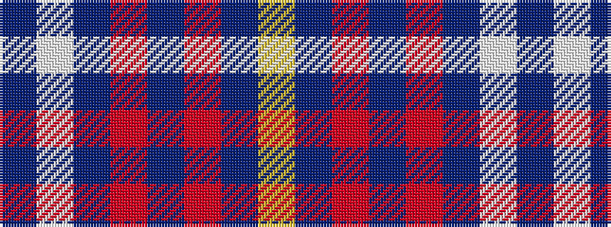

BWBRBRBY

It is a 8 stripe tartan.

<figure class="pat-woven">

<figcaption>idealised sample</figcaption>
</figure>

## Colour Sequence



## Tartans with this colour sequence

| Tartans |
|---------------|
| [Clemens and August (Personal)](/setts/s8/ly35db3r4db3r8db30w3db4~x2/)|
||
