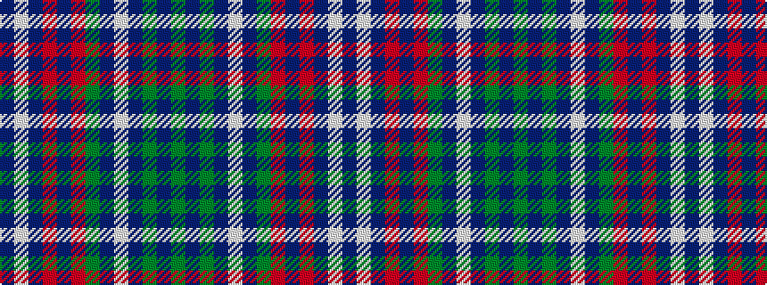

BWBRBRGBWBGBG

It is a 13 stripe tartan.

<figure class="pat-woven">

<figcaption>idealised sample</figcaption>
</figure>

## Colour Sequence



## Tartans with this colour sequence

This pattern is a design lineage: every tartan below shares one colour order, whatever its owner —
near-identical designs are grouped, the largest lineage first (#112: the pattern is a tartan's
second parent, beside its family or clan).

<table class="sett-table">
<tbody>
<tr><td><a href="/variants/s13/g12db6g6db22w4db8g4r8db10r3db48lb4db8/">Massachusetts - The Bay State</a></td></tr>
<tr><td class="sett-swatch"></td></tr>
<tr><td><a href="/variants/s13/g6db3g3db11w2db4g2r4db5r2db24lb2db4~x2/">Massachusetts-The Bay State</a></td></tr>
<tr><td class="sett-swatch"></td></tr>
</tbody>
</table>

