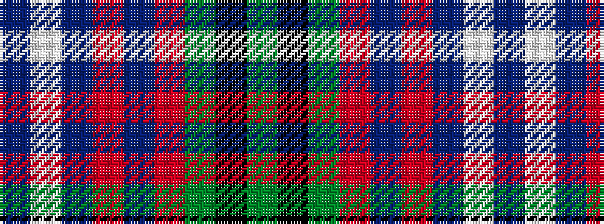

BWBRBRGKG

It is a 9 stripe tartan.

<figure class="pat-woven">

<figcaption>idealised sample</figcaption>
</figure>

## Colour Sequence



## Tartans with this colour sequence

| Tartans |
|---------------|
| [Dunbartonshire](/setts/s9/g11k2g1m4db1m4db13lt2db1~x4/)|
||
