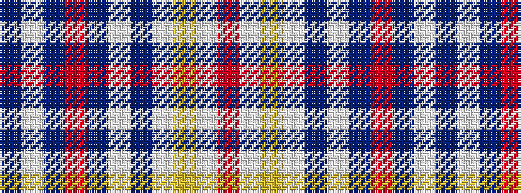

BWBRBWBWYWR

It is a 11 stripe tartan.

<figure class="pat-woven">

<figcaption>idealised sample</figcaption>
</figure>

## Colour Sequence



## Tartans with this colour sequence

| Tartans |
|---------------|
| [Fort William (Fashion)](/setts/s11/o10lb2lg3lb2do24lb4do4o34do2lb3do2~x2/)|
||
