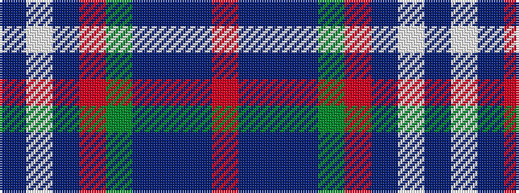

BWBRGBBBR

It is a 9 stripe tartan.

<figure class="pat-woven">

<figcaption>idealised sample</figcaption>
</figure>

## Colour Sequence



## Tartans with this colour sequence

| Tartans |
|---------------|
| [Spens/Spence (Clan)](/setts/s9/r26t1t10t1g32r11t8w3t1~x2/)|
||
