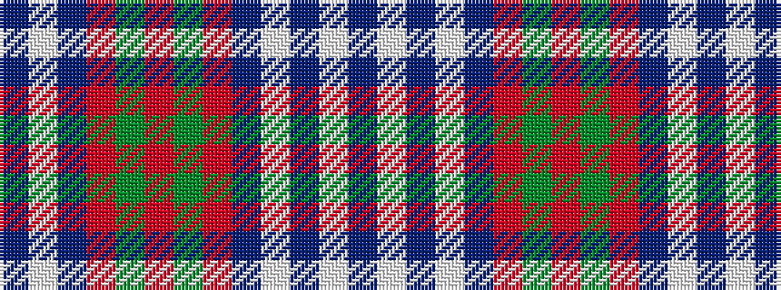

BWBRGRGRBWBWB

It is a 13 stripe tartan.

<figure class="pat-woven">

<figcaption>idealised sample</figcaption>
</figure>

## Colour Sequence



## Tartans with this colour sequence

| Tartans |
|---------------|
| [Black Watch (Piper)](/setts/s13/db12w2db2w2db2r10dg12r3dg12r10db12w2db2~x2/)|
||
