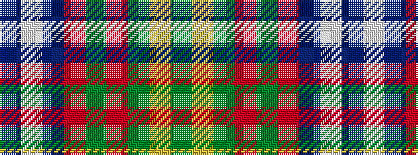

BWBRGRGYG

It is a 9 stripe tartan.

<figure class="pat-woven">

<figcaption>idealised sample</figcaption>
</figure>

## Colour Sequence



## Tartans with this colour sequence

| Tartans |
|---------------|
| [Longmore (Name)](/variants/s9/g15ly3g27r2g2r33b2w1b4~x2/)|
||
