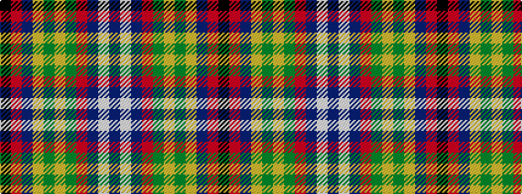

BWBRGYGYBRK

It is a 11 stripe tartan.

<figure class="pat-woven">

<figcaption>idealised sample</figcaption>
</figure>

## Colour Sequence



## Tartans with this colour sequence

| Tartans |
|---------------|
| [Aberdeen Asset Management (Corp)](/variants/s11/k6r2db18lo2g2lo2g10r20db2lb1db6~x2/)|
||
