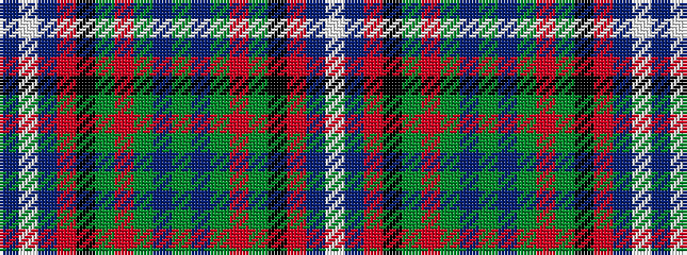

BWBRKGRGBGBGRGKRBW

It is a 18 stripe tartan.

<figure class="pat-woven">

<figcaption>idealised sample</figcaption>
</figure>

## Colour Sequence



## Tartans with this colour sequence

| Tartans |
|---------------|
| [Scotland the Brave](/setts/s18/db6w1db40m1k12dg12m6dg2dp2dg4~x2/)|
||
