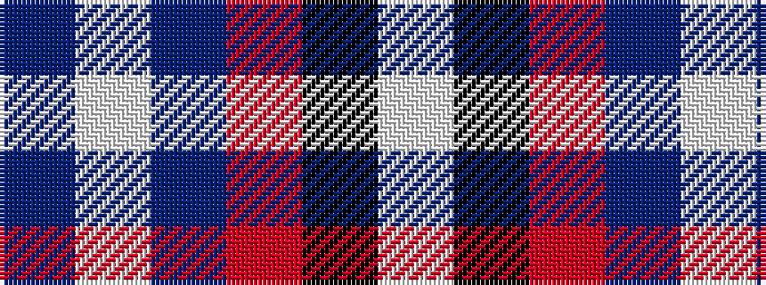

BWBRKW

It is a 6 stripe tartan.

<figure class="pat-woven">

<figcaption>idealised sample</figcaption>
</figure>

## Colour Sequence



## Tartans with this colour sequence

| Tartans |
|---------------|
| [Sirrell (2014)](/setts/s6/t19w20dp18r2k7lb15~x2/)|
||
| [Sirrell (2014)](/setts/s6/t19w20dt18r2k7lb15~x2/)|
||
