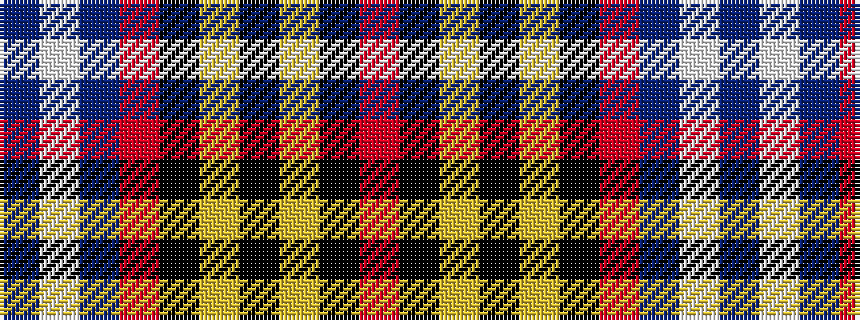

BWBRKYKYKR

It is a 10 stripe tartan.

<figure class="pat-woven">

<figcaption>idealised sample</figcaption>
</figure>

## Colour Sequence



## Tartans with this colour sequence

| Tartans |
|---------------|
| [Richardson](/variants/s10/r25k1ly2k1ly2k1r10db18w2db12~x2/)|
||
| [Richardson (Personal?)](/variants/s10/r25k1ly2k1ly2k1r10b18w2b12~x2/)|
||
