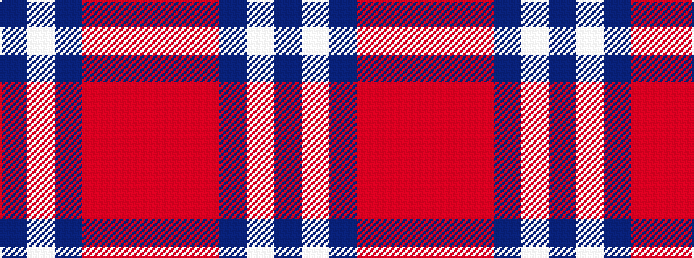

BWBRRR

It is a 6 stripe tartan.

<figure class="pat-woven">

<figcaption>idealised sample</figcaption>
</figure>

## Colour Sequence



## Tartans with this colour sequence

| Tartans |
|---------------|
| [Steffen, Markus (Personal)](/setts/s6/db35w4db10m3r3m3~x4/)|
||
| [Steffen, Morris (Personal)](/setts/s6/db35w4db10ri3r3ri3~x4/)|
||
