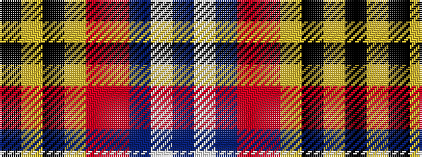

BWBRRYKYK

It is a 9 stripe tartan.

<figure class="pat-woven">

<figcaption>idealised sample</figcaption>
</figure>

## Colour Sequence



## Tartans with this colour sequence

| Tartans |
|---------------|
| [Lermontov](/variants/s9/k2ly1k2ly8r29o9db24w2db2~x2/)|
||
