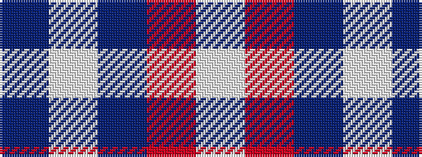

BWBRW

It is a 5 stripe tartan.

<figure class="pat-woven">

<figcaption>idealised sample</figcaption>
</figure>

## Colour Sequence



## Tartans with this colour sequence

| Tartans |
|---------------|
| [Fraser Arisaid Red (Dance)](/setts/s5/w32r12db12w2db3~x2/)|
||
| [Glen App](/setts/s5/p37w9p3o9w3~x2/)|
||
| [Glen Moy](/setts/s5/db13lb3db1r3lb1~x6/)|
||
| [Glen Moy](/setts/s5/db37w9db3r9w3~x2/)|
||
