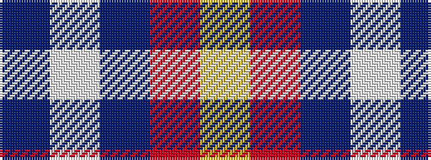

BWBRY

It is a 5 stripe tartan.

<figure class="pat-woven">

<figcaption>idealised sample</figcaption>
</figure>

## Colour Sequence



## Tartans with this colour sequence

| Tartans |
|---------------|
| [S.I.D.E. (Corporate)](/variants/s5/ly15r9t30w3db4~x2/)|
||
