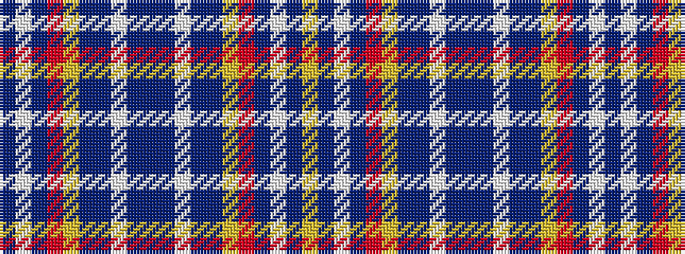

BWBRYBBWBBBWBBYRBWBY

It is a 20 stripe tartan.

<figure class="pat-woven">

<figcaption>idealised sample</figcaption>
</figure>

## Colour Sequence



## Tartans with this colour sequence

| Tartans |
|---------------|
| [Healy (Suspect)](/variants/s20/db2lb2b7r4ly8db4b10lb2db2b9db2lb2b10db4ly8r4b7lb2db2ly2~x4/)|
||
