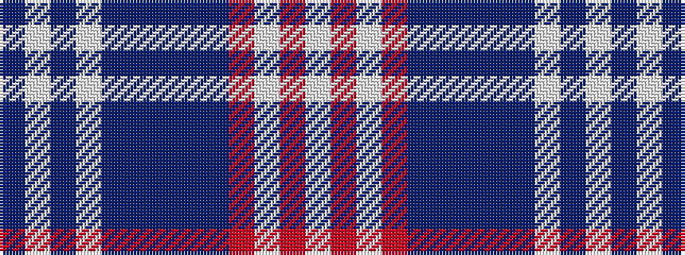

BWBWBBBBBRWRW

It is a 13 stripe tartan.

<figure class="pat-woven">

<figcaption>idealised sample</figcaption>
</figure>

## Colour Sequence



## Tartans with this colour sequence

| Tartans |
|---------------|
| [Daughters of the American Revolution](/setts/s13/b2w2b5w2b4b5b6b14db18r4w2r4w2~x2/)|
||
