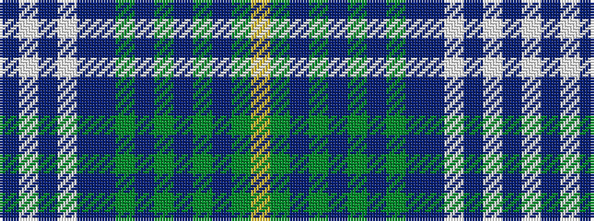

BWBWBBGBGBGBGY

It is a 14 stripe tartan.

<figure class="pat-woven">

<figcaption>idealised sample</figcaption>
</figure>

## Colour Sequence



## Tartans with this colour sequence

| Tartans |
|---------------|
| [St. Andrews (District)](/variants/s14/db48w3db4w3db3b16g2b5g3b4g4b3g5ly2~x2/)|
||
