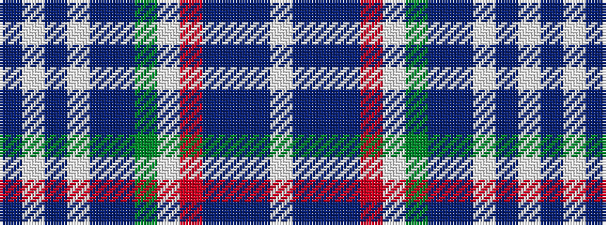

BWBWBBGWRBBBW

It is a 13 stripe tartan.

<figure class="pat-woven">

<figcaption>idealised sample</figcaption>
</figure>

## Colour Sequence



## Tartans with this colour sequence

| Tartans |
|---------------|
| [Spirit of India](/setts/s13/b32w2db1w2b4db1g8w8r8db1b16db1w4~x2/)|
||
