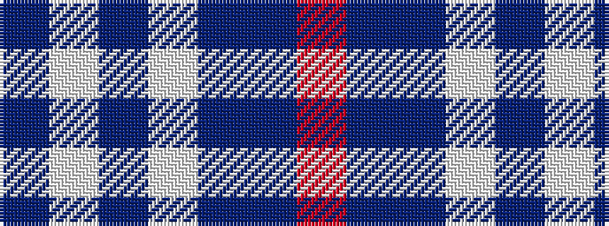

BWBWBBR

It is a 7 stripe tartan.

<figure class="pat-woven">

<figcaption>idealised sample</figcaption>
</figure>

## Colour Sequence



## Tartans with this colour sequence

| Tartans |
|---------------|
| [Federal Bureau of Investigation](/setts/s7/db6lb2db2lb3db16b26r2~x2/)|
||
| [Keela (Corporate)](/setts/s7/dt7w3dt2w6dt16t26r4~x2/)|
||
