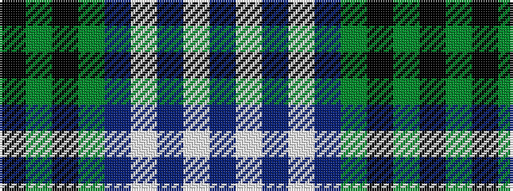

BWBWBGKGK

It is a 9 stripe tartan.

<figure class="pat-woven">

<figcaption>idealised sample</figcaption>
</figure>

## Colour Sequence



## Tartans with this colour sequence

| Tartans |
|---------------|
| [Historic Scotland](/setts/s9/db4w1db1w3db24y9k1y9k3~x2/)|
||
