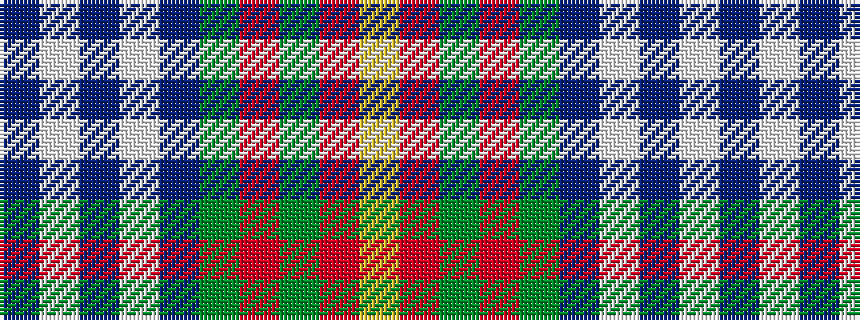

BWBWBGRGRY

It is a 10 stripe tartan.

<figure class="pat-woven">

<figcaption>idealised sample</figcaption>
</figure>

## Colour Sequence



## Tartans with this colour sequence

| Tartans |
|---------------|
| [Chinese Scottish (Corporate)](/variants/s10/db58w2db1w1db6g3r3g6r24ly3~x2/)|
||
