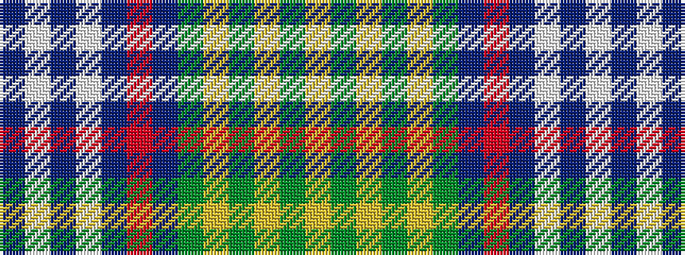

BWBWBRBGYGYGY

It is a 13 stripe tartan.

<figure class="pat-woven">

<figcaption>idealised sample</figcaption>
</figure>

## Colour Sequence



## Tartans with this colour sequence

| Tartans |
|---------------|
| [Roach (2015)](/setts/s13/t18w1t1w1t4r4dt1g12lo1g1lo1g1lo1~x4/)|
||
