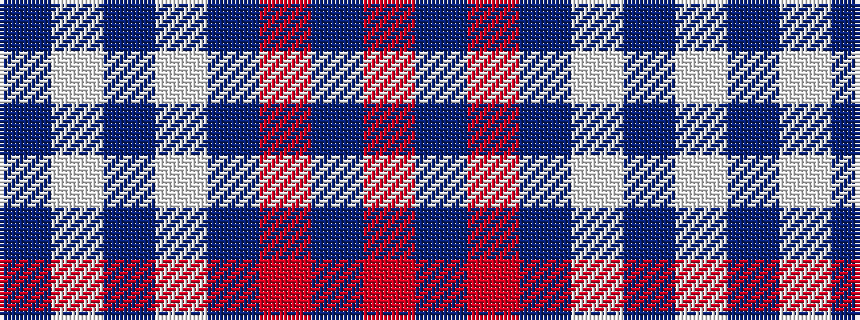

BWBWBRBR

It is a 8 stripe tartan.

<figure class="pat-woven">

<figcaption>idealised sample</figcaption>
</figure>

## Colour Sequence



## Tartans with this colour sequence

| Tartans |
|---------------|
| [Raith Rovers Football Club](/setts/s8/dt3w2db2w3dt24r1db36r1~x2/)|
||
