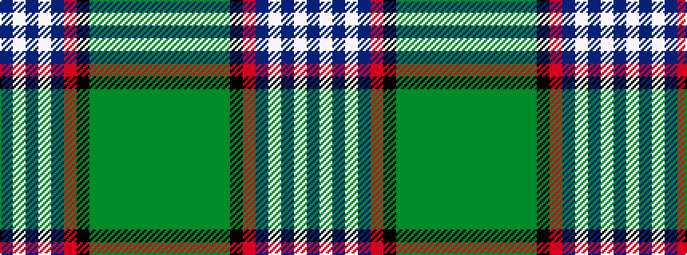

BWBWBRKGGGGGG

It is a 13 stripe tartan.

<figure class="pat-woven">

<figcaption>idealised sample</figcaption>
</figure>

## Colour Sequence



## Tartans with this colour sequence

| Tartans |
|---------------|
| [Roach (2015)](/variants/s13/db18w1db1w1db4r4k1g12dy1g1dy1g1dy1~x4/)|
||
