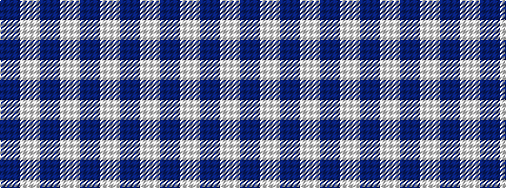

BWBWBW

It is a [6 stripe pattern](/stripes/stripes6/) — every 6-stripe pattern is gathered there.

<figure class="pat-woven">

<figcaption>idealised sample</figcaption>
</figure>

## Colour Sequence



## Tartans with this colour sequence

This pattern is a design lineage: every tartan below shares one colour order, whatever its owner —
near-identical designs are grouped, the largest lineage first (#112: the pattern is a tartan's
second parent, beside its family or clan).

<table class="sett-table">
<tbody>
<tr><td><a href="/tartans/e/er/erskine-blanket/">Erskine Blanket</a></td></tr>
<tr><td class="sett-swatch"></td></tr>
<tr><td><a href="/tartans/m/ma/macmugen/">MacMugen</a> <small class="dt">ΔTartan 0.62</small></td></tr>
<tr><td class="sett-swatch"></td></tr>
<tr><td><a href="/tartans/i/ik/ikelman-3/">Ikelman</a> <small class="dt">ΔTartan 0.85</small></td></tr>
<tr><td class="sett-swatch"></td></tr>
<tr><td><a href="/tartans/h/ha/harmony-13/">Harmony 13</a> <small class="dt">ΔTartan 0.91</small></td></tr>
<tr><td class="sett-swatch"></td></tr>
<tr class="cluster-sep"><td></td></tr>
<tr><td><a href="/tartans/b/bu/buchanan-dress/">Buchanan Dress</a> <small class="dt">ΔTartan 1.66</small></td></tr>
<tr><td class="sett-swatch"></td></tr>
<tr class="cluster-sep"><td></td></tr>
<tr><td><a href="/tartans/e/er/erskine-4/">Erskine</a> <small class="dt">ΔTartan 4.68</small></td></tr>
<tr><td class="sett-swatch"></td></tr>
<tr class="cluster-sep"><td></td></tr>
<tr><td><a href="/tartans/a/ai/ailsa-royal/">Ailsa Royal</a> <small class="dt">ΔTartan 4.73</small></td></tr>
<tr><td class="sett-swatch"></td></tr>
<tr class="cluster-sep"><td></td></tr>
<tr><td><a href="/tartans/e/er/erskine-dress-burgandy/">Erskine Dress Burgandy</a> <small class="dt">ΔTartan 5.70</small></td></tr>
<tr><td class="sett-swatch"></td></tr>
<tr class="cluster-sep"><td></td></tr>
<tr><td><a href="/tartans/d/dr/dram/">Dram!</a> <small class="dt">ΔTartan 5.82</small></td></tr>
<tr><td class="sett-swatch"></td></tr>
<tr class="cluster-sep"><td></td></tr>
<tr><td><a href="/tartans/b/bu/butties/">Butties</a> <small class="dt">ΔTartan 6.67</small></td></tr>
<tr><td class="sett-swatch"></td></tr>
<tr class="cluster-sep"><td></td></tr>
<tr><td><a href="/tartans/m/mo/monica/">Monica</a> <small class="dt">ΔTartan 7.66</small></td></tr>
<tr><td class="sett-swatch"></td></tr>
</tbody>
</table>

