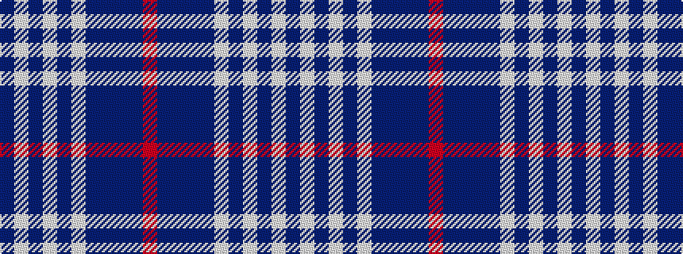

BWBWBWBBBBR

It is a 11 stripe tartan.

<figure class="pat-woven">

<figcaption>idealised sample</figcaption>
</figure>

## Colour Sequence



## Tartans with this colour sequence

This pattern is a design lineage: every tartan below shares one colour order, whatever its owner —
near-identical designs are grouped, the largest lineage first (#112: the pattern is a tartan's
second parent, beside its family or clan).

<table class="sett-table">
<tbody>
<tr><td><a href="/variants/s11/db3w1db1w1db2w3db15t2db2t22r2~x2/">Commonwealth Games 1986 (Corp)</a></td></tr>
<tr><td class="sett-swatch"></td></tr>
<tr><td><a href="/variants/s11/db6w2db2w2db4w6db28b4db4b45r4/">Edinburgh, '86</a></td></tr>
<tr><td class="sett-swatch"></td></tr>
<tr class="cluster-sep"><td></td></tr>
<tr><td><a href="/variants/s11/n3w1n1w1n2w3n14db2n2db32r2~x2/">Unknown</a></td></tr>
<tr><td class="sett-swatch"></td></tr>
</tbody>
</table>

