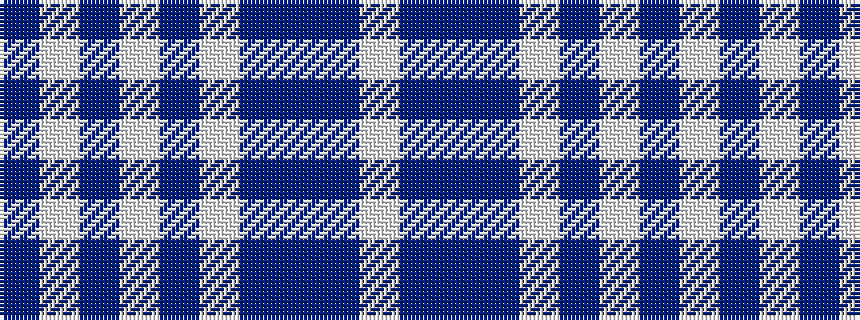

BWBWBWBBBW

It is a 10 stripe tartan.

<figure class="pat-woven">

<figcaption>idealised sample</figcaption>
</figure>

## Colour Sequence



## Tartans with this colour sequence

| Tartans |
|---------------|
| [Siddle](/setts/s10/dr3w29db2w2db2w2db14dr31db2w2~x2/)|
||
