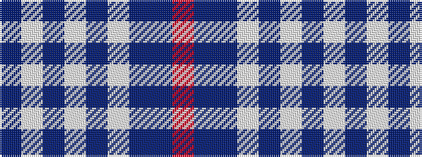

BWBWBWBBR

It is a 9 stripe tartan.

<figure class="pat-woven">

<figcaption>idealised sample</figcaption>
</figure>

## Colour Sequence



## Tartans with this colour sequence

| Tartans |
|---------------|
| [RAAF #3](/setts/s9/t48w2t7w2t7w2t20db11r2~x2/)|
||
| [RAAF #4](/setts/s9/db48w2db7w2db7w2db20t11r2~x2/)|
||
