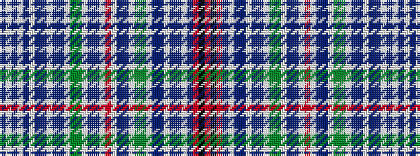

BWBWBWBBWBBWGGWBBWRWBBWGGWBBWBBWBRKR

It is a 36 stripe tartan.

<figure class="pat-woven">

<figcaption>idealised sample</figcaption>
</figure>

## Colour Sequence



## Tartans with this colour sequence

| Tartans |
|---------------|
| [Mackintosh #7](/setts/s36/dp7w1dp7w1dp24w1dp2t2w1t2dp2w1dg10g3w1dp4t2w1r3w1t2dp3w1g3dg10w1dp2t2w1t2dp2w1dp6r16k2r2~x2/)|
||
