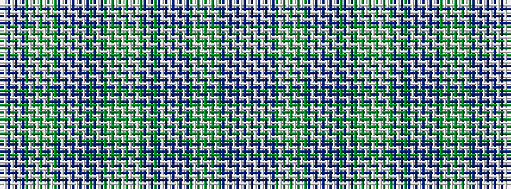

BWBWBWBGWGWGWGWGBWBWBWBWBGBWBGWGWGWGWGWGBWBGBWBWBWBWBGWGWGWGWGBWBWBWBW

It is a 70 stripe tartan.

<figure class="pat-woven">

<figcaption>idealised sample</figcaption>
</figure>

## Colour Sequence



## Tartans with this colour sequence

| Tartans |
|---------------|
| [Campbell of Cawdor Dress (Clan)](/variants/s70/db10w10db1w2db1w10db10g2w2g24w2g2w2g24w2g2db10w10db1w2db1w10db10w10db2g3db2w10db10g2w2g24w2g2w2g2w2g24w2g2db10w10db2g3db2w10db10w10db1w2db1w10db10g2w2g24w2g2w2g24w2g2db10w10db1w2db1w10db10w10~x2/)|
||
