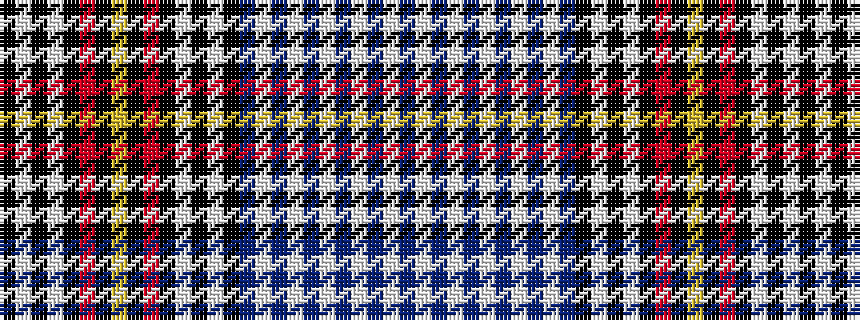

BWBWBWBWBWBKWKWKRKYKRKWKWK

It is a 26 stripe tartan.

<figure class="pat-woven">

<figcaption>idealised sample</figcaption>
</figure>

## Colour Sequence



## Tartans with this colour sequence

| Tartans |
|---------------|
| [Britten-Norman](/setts/s26/dt28w1dt2w1dt3w1dt2w2dt2w2dt25k10w1k2lb2k20r1k2lr3k2r1k20lb2k1w1k10~x2/)|
||
