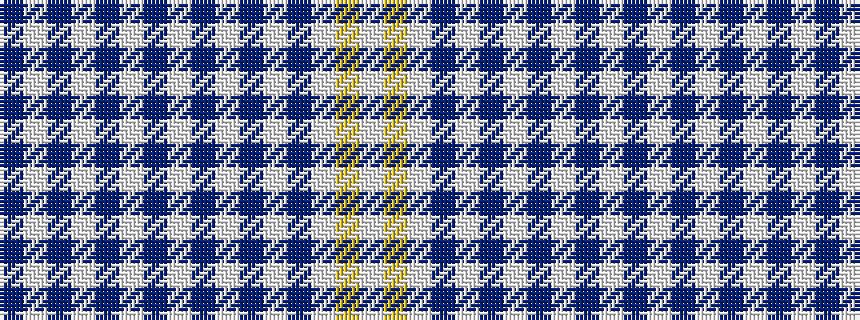

BWBWBWBWBWBWBWYW

It is a 16 stripe tartan.

<figure class="pat-woven">

<figcaption>idealised sample</figcaption>
</figure>

## Colour Sequence



## Tartans with this colour sequence

| Tartans |
|---------------|
| [UPS No.2](/variants/s16/do2w8do4wi1do2wi2do2wi1do4w60do2w15do2w2lo2w2~x2/)|
||
