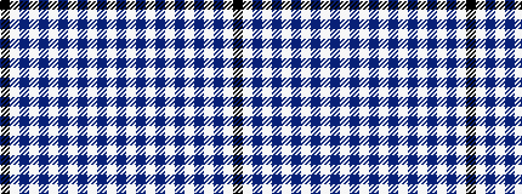

BWBWBWBWBWBWK

It is a 13 stripe tartan.

<figure class="pat-woven">

<figcaption>idealised sample</figcaption>
</figure>

## Colour Sequence



## Tartans with this colour sequence

| Tartans |
|---------------|
| [Hanna](/setts/k16w25db4w2db4w2db4w2db4w2db4w2db4/)|
||
| [Hanna Personal Tartan](/variants/s13/k8w13db2w1db2w1db2w1db2w1db2w1db2~x2/)|
||
