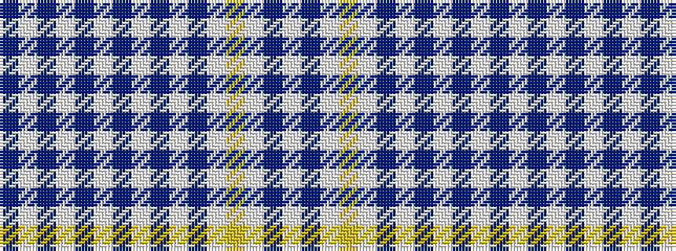

BWBWBWBWBWBWYWBW

It is a 16 stripe tartan.

<figure class="pat-woven">

<figcaption>idealised sample</figcaption>
</figure>

## Colour Sequence



## Tartans with this colour sequence

| Tartans |
|---------------|
| [UPS No. 2 (Corporate)](/variants/s16/w8do2w2lo2w2do2w15do2w60do4wi1do2wi2do2wi1do4~x2/)|
||
