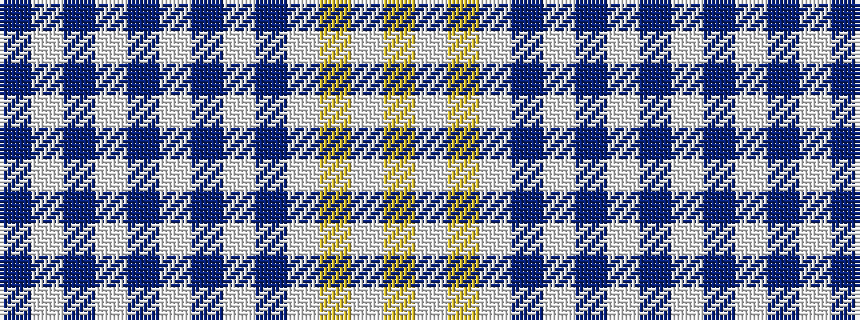

BWBWBWBWBWYWY

It is a 13 stripe tartan.

<figure class="pat-woven">

<figcaption>idealised sample</figcaption>
</figure>

## Colour Sequence



## Tartans with this colour sequence

| Tartans |
|---------------|
| [Highland Park HS Pipe Band](/setts/s13/ly22w1ly2w2db2w1db14w1db2w2db2w1db14~x4/)|
||
