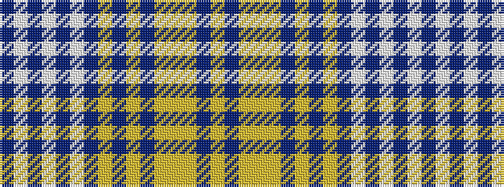

BWBWBWBYBYBYYYBY

It is a 16 stripe tartan.

<figure class="pat-woven">

<figcaption>idealised sample</figcaption>
</figure>

## Colour Sequence



## Tartans with this colour sequence

| Tartans |
|---------------|
| [UPS No. 1 (Corporate)](/setts/s16/ly8do2ly2lo2ly2do2ly15do2ly60do4w1do2w2do2w1do4~x2/)|
||
