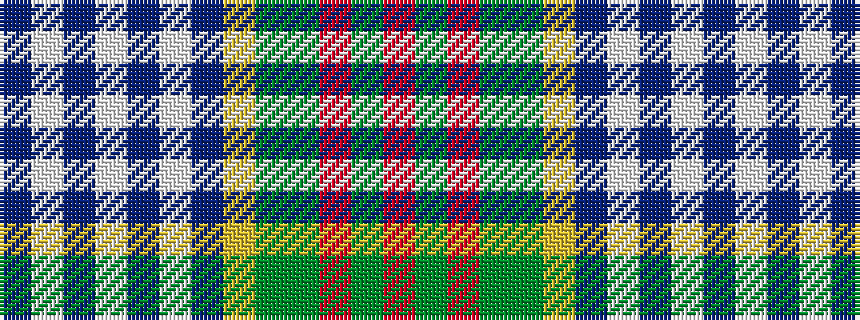

BWBWBWBYGGRGR

It is a 13 stripe tartan.

<figure class="pat-woven">

<figcaption>idealised sample</figcaption>
</figure>

## Colour Sequence



## Tartans with this colour sequence

| Tartans |
|---------------|
| [Saint Joseph de Sorel](/variants/s13/r12g2o5g2y9ly2t8w1t3w1t3w1t8~x2/)|
||
