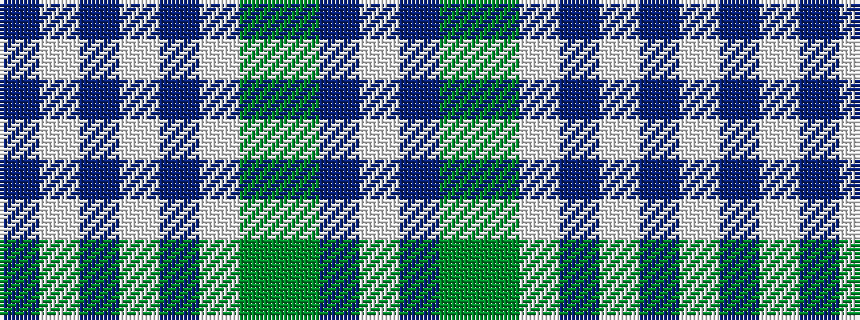

BWBWBWGGBW

It is a 10 stripe tartan.

<figure class="pat-woven">

<figcaption>idealised sample</figcaption>
</figure>

## Colour Sequence



## Tartans with this colour sequence

| Tartans |
|---------------|
| [Greenshields, Simon (Personal)](/setts/s10/dt40lb3dt3lb3dt3lb4dg8g8n8w2~x2/)|
||
