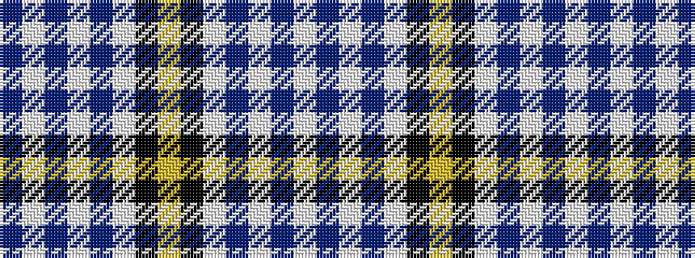

BWBWBWKYKWBWBW

It is a 14 stripe tartan.

<figure class="pat-woven">

<figcaption>idealised sample</figcaption>
</figure>

## Colour Sequence



## Tartans with this colour sequence

| Tartans |
|---------------|
| [Kile (No red line) (Personal)](/setts/s14/db20w3db3w3db3w3k5ly10~x2/)|
||
