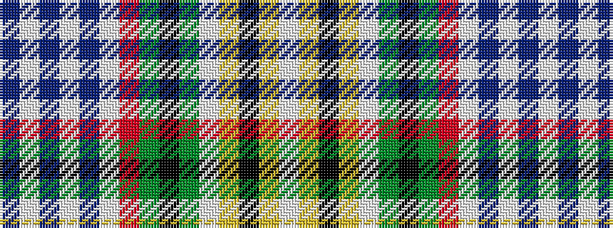

BWBWBWRGKGWYKYW

It is a 15 stripe tartan.

<figure class="pat-woven">

<figcaption>idealised sample</figcaption>
</figure>

## Colour Sequence



## Tartans with this colour sequence

| Tartans |
|---------------|
| [Salaberry-de-Valleyfield Cer. (Dis )](/setts/s15/w16lo1k2lo1w16g2k1g2r22w4db3w4db3w4db3~x2/)|
||
