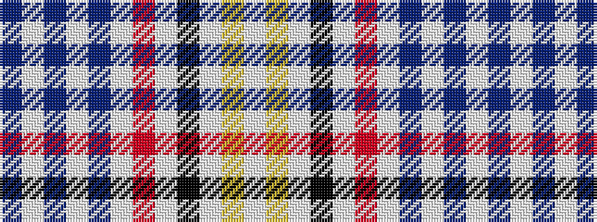

BWBWBWRWKWYW

It is a 12 stripe tartan.

<figure class="pat-woven">

<figcaption>idealised sample</figcaption>
</figure>

## Colour Sequence



## Tartans with this colour sequence

| Tartans |
|---------------|
| [Old England House Check](/variants/s12/w46lr4w9k8w9r4w9do2w2do2w2do2~x2/)|
||
