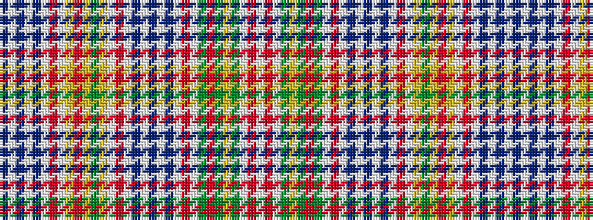

BWBWBWRWYRYGYWRWBWBWBWRWGRGYGWRW

It is a 32 stripe tartan.

<figure class="pat-woven">

<figcaption>idealised sample</figcaption>
</figure>

## Colour Sequence



## Tartans with this colour sequence

| Tartans |
|---------------|
| [New Elgin Primary School](/setts/s32/db8w5db5w5db8w2r1w2ly3r6ly3g6ly14w2r1w2db8w5db5w5db8w2r1w2g3r6g3ly6g14w2r1w2~x2/)|
||
