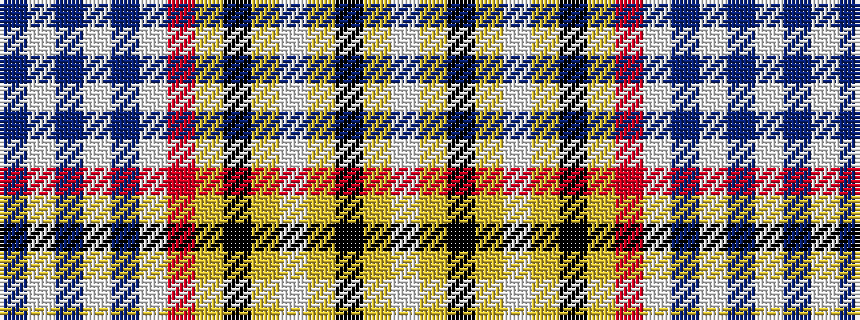

BWBWBWRYKYWYKYW

It is a 15 stripe tartan.

<figure class="pat-woven">

<figcaption>idealised sample</figcaption>
</figure>

## Colour Sequence



## Tartans with this colour sequence

| Tartans |
|---------------|
| [Salaberry-de-Valleyfield Ceremonial](/setts/s15/w16ly1k2ly1w16lg2k1lg2r22w4db3w4db3w4db3~x2/)|
||
