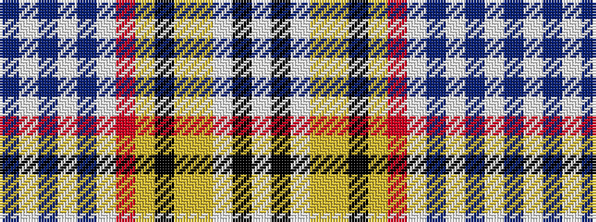

BWBWBWRYKYYWKW

It is a 14 stripe tartan.

<figure class="pat-woven">

<figcaption>idealised sample</figcaption>
</figure>

## Colour Sequence



## Tartans with this colour sequence

| Tartans |
|---------------|
| [Salaberry-de-Valleyfield Traditional](/variants/s14/db20w3db4w3db4w3r22lg2k1lg2ly16w1k2w1~x2/)|
||
