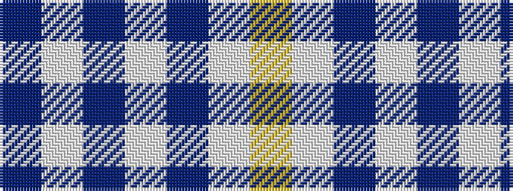

BWBWBWY

It is a 7 stripe tartan.

<figure class="pat-woven">

<figcaption>idealised sample</figcaption>
</figure>

## Colour Sequence



## Tartans with this colour sequence

| Tartans |
|---------------|
| [Talisker](/variants/s7/db16wi4db1wi2db24w1lo4~x2/)|
||
