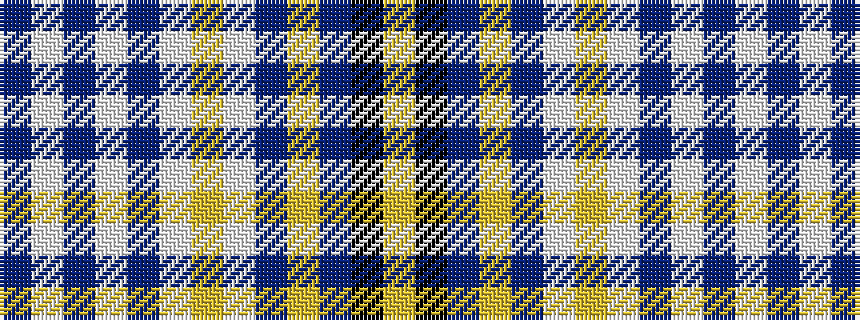

BWBWBWYWBYBKY

It is a 13 stripe tartan.

<figure class="pat-woven">

<figcaption>idealised sample</figcaption>
</figure>

## Colour Sequence



## Tartans with this colour sequence

| Tartans |
|---------------|
| [Jouy (La Chapelle Saint Sulpice) (Personal)](/setts/s13/b5w5b5w5b15w1lo2w1b21ly2b5k2ly4~x2/)|
||
