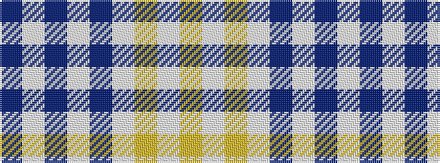

BWBWBWYWY

It is a 9 stripe tartan.

<figure class="pat-woven">

<figcaption>idealised sample</figcaption>
</figure>

## Colour Sequence



## Tartans with this colour sequence

| Tartans |
|---------------|
| [Highland Park High School (Texas)](/setts/s9/db19w1db6w1db2w2lo2w1lo18~x4/)|
||
| [Highland Park High School (Texas)](/setts/s9/db19w1db6w1db2w2ly2w1ly18~x4/)|
||
