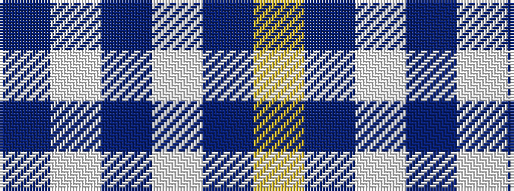

BWBWBY

It is a 6 stripe tartan.

<figure class="pat-woven">

<figcaption>idealised sample</figcaption>
</figure>

## Colour Sequence



## Tartans with this colour sequence

| Tartans |
|---------------|
| [Auchterlonie (Personal)](/variants/s6/db40w8db25w14db8ly4~x2/)|
||
| [Machair](/variants/s6/lo72dt16w9dt4w5dt16~x2/)|
||
| [Ochterlonie](/variants/s6/dt30w7dt18w11dt6ly3~x2/)|
||
| [Whitley (Personal)](/variants/s6/b1w5b1w5b15ly1~x4/)|
||
