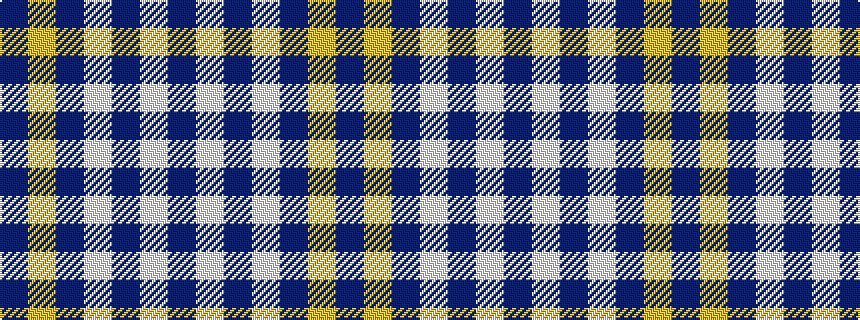

BWBWBYB

It is a 7 stripe tartan.

<figure class="pat-woven">

<figcaption>idealised sample</figcaption>
</figure>

## Colour Sequence



## Tartans with this colour sequence

| Tartans |
|---------------|
| [Scottish Qualifications Auth. (Corp)](/variants/s7/db36lo5db8lb3db8lb10db3~x2/)|
||
